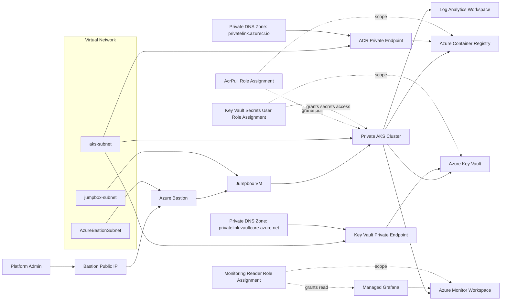
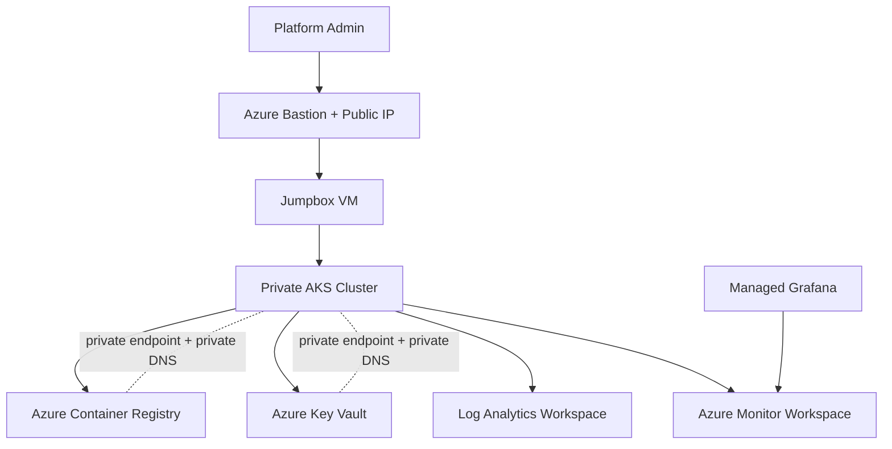

# Production Hardened Private AKS Platform (Bicep)

This project deploys a production-focused AKS landing zone with hardened defaults:

- Private AKS control plane
- VNet with dedicated AKS, Bastion, and jumpbox subnets
- Azure Bastion for private admin access path
- Autoscaling system and user node pools
- Optional autoscaling spot node pool
- Azure Container Registry (ACR)
- Azure Key Vault with RBAC and purge protection
- Log Analytics Workspace
- Azure Monitor Workspace
- Managed Grafana integrated with Monitor Workspace
- Managed Prometheus enabled on AKS
- PSRule for Azure checks
- Prerequisite registration script
- Vulnerability scan helper script

## Architecture Diagram



Legend: solid arrows represent primary traffic/dependency flow. Dashed arrows represent logical relationships such as RBAC scope or private connectivity overlays.

### High-Level View



Legend: solid arrows represent primary traffic/dependency flow. Dashed arrows represent private connectivity overlays.

## Keeping Diagrams Up To Date

Use this workflow whenever `main.bicep` changes architecture resources or relationships.

1. Rebuild the template to ensure the source model is valid:

```bash
az bicep build --file main.bicep
```

2. List resource declarations to identify new/removed components:

```bash
rg -n "^resource " main.bicep
```

3. Check connectivity and dependency lines you should reflect in Mermaid:

```bash
rg -n "privateEndpoints|privateDnsZones|roleAssignments|managedClusters|grafana|registries|vaults|workspaces|accounts|bastionHosts|virtualNetworks|virtualMachines" main.bicep
```

4. Update both Mermaid blocks in this README:
- Detailed block under `## Architecture Diagram`
- Simplified block under `### High-Level View`

5. Keep visual consistency:
- Solid arrows for primary traffic/dependency flow
- Dashed arrows for overlays/indirect relationships (RBAC, private DNS/private endpoint overlays)

6. Validate Mermaid rendering in Markdown preview before committing.

Recommended review checklist:
- Every `resource` in `main.bicep` appears in at least one diagram (or is intentionally omitted from the high-level view).
- New private endpoints, DNS zones, and role assignments are represented.
- Node labels still match current service names and intent.

## Project Files

- `main.bicep`: Main deployment template
- `main.prod.bicepparam`: Parameter overrides for production
- `scripts/prereqs.sh`: Provider/feature registration checks
- `scripts/scan.sh`: IaC vulnerability scan wrapper
- `.trivyignore`: Trivy rule baseline (documented false-positive exceptions)
- `.checkov.yaml`: Checkov baseline configuration
- `ps-rule/ps-rule.yaml`: PSRule config for Azure checks

## Prerequisites

1. Azure CLI logged in (`az login`)
2. Bicep CLI (`az bicep install`)
3. `jq` (required by prereq script)
4. Optional scanner: `trivy` or `checkov`
5. PowerShell + PSRule modules for policy checks:
   - `Install-Module PSRule -Scope CurrentUser`
   - `Install-Module PSRule.Rules.Azure -Scope CurrentUser`

## 1. Register Azure Prerequisites

```bash
chmod +x scripts/prereqs.sh
./scripts/prereqs.sh <subscription-id>
```

## 2. Configure Parameters

Edit `main.prod.bicepparam`:

- `jumpboxSshPublicKey`
- `keyVaultName` (must be globally unique)
- resource names and CIDRs if needed
- node pool sizes/counts
- feature switches (`enableSpotPool`, `enableDefender`, `enableManagedPrometheus`)

All deployment values are overridable from the `.bicepparam` file.

## 3. Validate and Deploy

```bash
az deployment group validate \
  --resource-group <rg-name> \
  --template-file main.bicep \
  --parameters main.prod.bicepparam

az deployment group create \
  --resource-group <rg-name> \
  --template-file main.bicep \
  --parameters main.prod.bicepparam
```

## 4. Control Plane Access via Bastion

The AKS API server is private (`publicNetworkAccess=Disabled`).

Recommended admin path:

1. Connect to the private Bastion host from a network path that can resolve and reach the VNet (for example, corporate network over VPN/ExpressRoute), then open a Bastion session to the jumpbox VM (`<prefix>-jump`)
2. On jumpbox, use Azure CLI and `kubectl`:

```bash
az login
az aks get-credentials -g <rg-name> -n <aks-name>
kubectl get nodes
```

## 5. Grafana and Prometheus

Managed Grafana is deployed and integrated with Azure Monitor Workspace.

1. Open Managed Grafana from portal
2. Confirm Azure Monitor data source is present
3. Import AKS/Prometheus dashboards (for example, Kubernetes Compute Resources)

AKS is configured with `azureMonitorProfile.metrics.enabled=true` for managed Prometheus scraping.

## 6. Kubernetes Dashboard and Sample App

Deploy a sample workload:

```bash
kubectl create namespace sample
kubectl -n sample create deployment web --image=mcr.microsoft.com/azuredocs/aks-helloworld:v1
kubectl -n sample expose deployment web --type=ClusterIP --port=80
kubectl -n sample get pods,svc
```

Optional dashboard (for test use only):

```bash
kubectl apply -f https://raw.githubusercontent.com/kubernetes/dashboard/v2.7.0/aio/deploy/recommended.yaml
kubectl proxy
```

Then browse:

- `http://localhost:8001/api/v1/namespaces/kubernetes-dashboard/services/https:kubernetes-dashboard:/proxy/`

## 7. PSRule Checks

From PowerShell:

```powershell
Assert-PSRule -InputPath . -Module PSRule.Rules.Azure -Option ps-rule/ps-rule.yaml
```

## 8. Vulnerability Scanning

```bash
chmod +x scripts/scan.sh
./scripts/scan.sh
```

The script attempts `trivy` first, then `checkov`.
The baseline files are applied automatically when present.

### Scanner Baseline Rationale

The project keeps narrowly scoped suppressions for scanner behavior that does not match this template's runtime posture.

`Trivy` (`.trivyignore`)

- `AZU-0013`: Trivy flags Key Vault network ACL default behavior in the compiled ARM output even though this template sets `publicNetworkAccess: 'Disabled'` and `networkAcls.defaultAction: 'Deny'`.

`Checkov` (`.checkov.yaml`)

- `CKV_AZURE_6`: Private AKS control plane design conflicts with rule expectation around authorized IP ranges.
- `CKV_AZURE_50`: VM extension rule is not meaningful for this Linux jumpbox baseline.
- `CKV_AZURE_42`: Key Vault recoverability is configured (`softDeleteRetentionInDays` and purge protection) but still flagged by parser behavior.
- `CKV_AZURE_172`: Secrets Store CSI auto-rotation is configured via addon config, but not consistently recognized.
- `CKV_AZURE_226`: Ephemeral OS disk settings are defined on computed agent pool objects and may not be resolved by parser.
- `CKV_AZURE_168`: Rule throws a runtime parser error against computed `agentPoolProfiles` shape.
- `CKV_AZURE_227`: Host encryption settings are defined on computed agent pool objects and may not be resolved by parser.

These suppressions should be reviewed periodically and removed as scanner engines improve.

## 9. Teardown

```bash
az group delete --name <rg-name> --yes --no-wait
```

## Security Notes

- AKS local accounts are disabled
- AKS control plane public access is disabled
- AKS private cluster is enabled
- Key Vault RBAC + purge protection enabled
- ACR admin user disabled
- Private endpoints are available for ACR/Key Vault
- Private DNS zones, VNet links, and private endpoint zone groups are configured for ACR and Key Vault
- Bastion is deployed with a Standard public IP for admin connectivity
- OIDC issuer and workload identity profile are enabled for modern pod identity patterns
